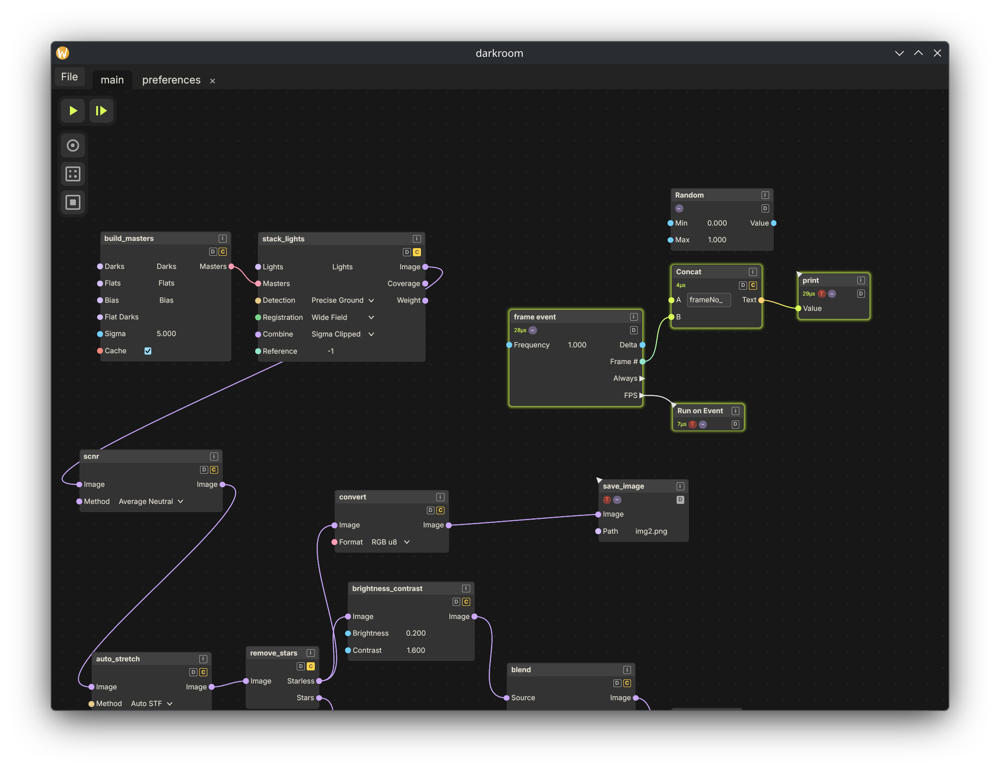

<p align="center">
  
</p>

<h1 align="center">Darkroom</h1>

<p align="center">
  A node-graph editor for image &amp; data pipelines — build a graph, wire it up, watch it run.
</p>

---

Darkroom lets you assemble a processing pipeline as a node graph and run it
live: wire nodes together and the graph **compiles → plans → executes** on a
background worker, streaming each node's status and results back onto the canvas
as it goes. It's a native desktop app built on [Aperture](aperture) — an
in-house immediate-mode GUI with a wgpu renderer — over a domain-agnostic graph
engine. Its first workload is imaging: general image processing and an
astronomical stacking pipeline.

<p align="center">
  
</p>

## Run it

```sh
cargo run                 # launches Darkroom (the default member)
```

## Features

- **Node-graph canvas** — pan/zoom, rubber-band select, drag between ports to
  wire nodes, a right-click spawn menu, and a "breaker" scribble that severs
  wires and deletes nodes in one gesture.
- **Graphs** — collapse a selection into a reusable composite, edit its
  interior in its own tab, and promote it to a shared library.
- **Live async execution** — the graph runs on a background tokio worker; each
  node glows with its status (running / cached / executed / errored) and shows
  its elapsed time as results stream back on-frame.
- **Inline editing + previews** — edit constants in place; open a node's
  inspector for its live input/output values, including image previews uploaded
  straight to the GPU.
- **Per-document disk cache** — flag a node to persist its output beside the
  project file, so reproducible results reload across sessions instead of
  recomputing.
- **Undo everything** — every edit, plus the camera, selection, and node
  stacking order, routes through one intent/undo pipeline and round-trips
  through save/load.

## Under the hood

Darkroom is a Cargo workspace. The app is one crate; the rest is the engine, the
GUI, and the imaging stack it draws on:

| Crate | Role |
|-------|------|
| **[darkroom](darkroom)** | The editor app itself — canvas, node UI, and the edit/undo pipeline. *Default member.* |
| **scenarium** | The headless graph engine: the graph model plus compile→plan→execute on a tokio worker. |
| **[aperture](https://github.com/xorza/Aperture)** | The immediate-mode GUI — WPF-style two-pass layout, wgpu renderer. *Submodule.* |
| **common** | Shared leaf utilities: typed UUID ids, serialization + format detection, 2D buffers, async primitives. |
| **lens** | The image + astronomical node libraries — adapts `imaginarium` operations into graph nodes. |
| **imaginarium** | Image library with CPU and wgpu GPU operations. *Submodule.* |
| **lumos** | Astronomical pipeline: RAW/FITS decode, calibration, star detection, registration, stacking, drizzle. |
| **fits-well** | A fast reader/writer for FITS (astronomy's image format), targeting the full FITS 4.0 standard. *Submodule.* |
| **quickbench** | A tiny micro-benchmark harness (`#[test] #[ignore]`, run via `cargo test`). *Submodule.* |

`common` is the pure leaf; `scenarium` builds the graph engine on it; `darkroom`
edits a `scenarium::Graph`, renders it through `aperture`, and pulls node
libraries from `lens` (over `imaginarium` / `lumos` / `fits-well`).
